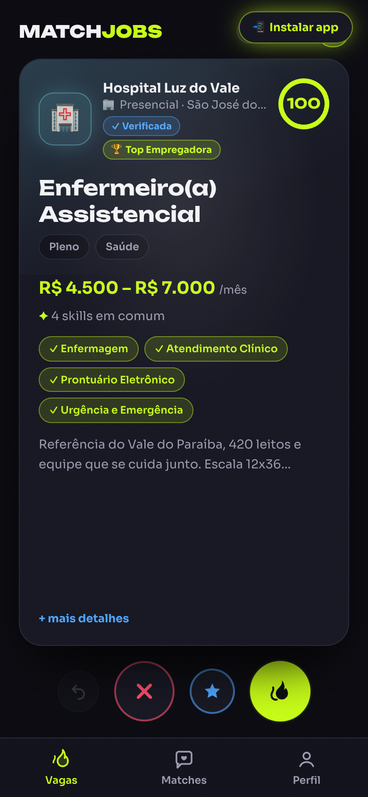
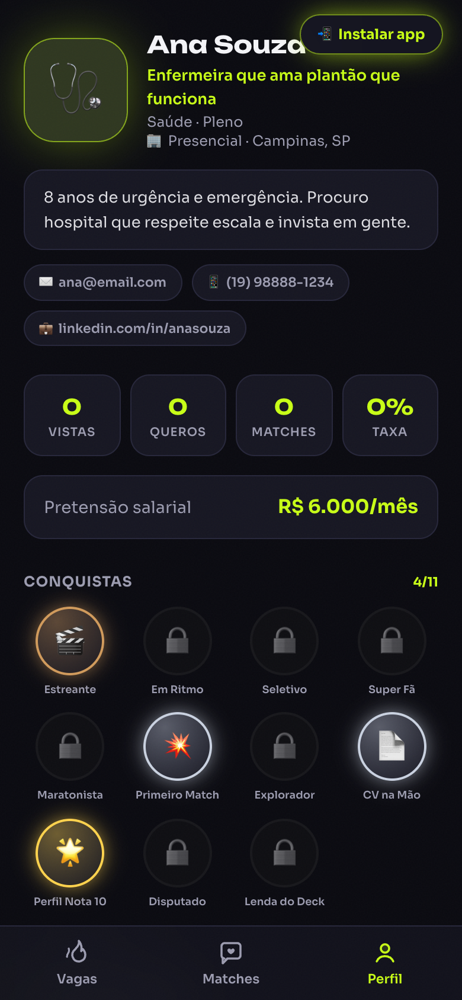
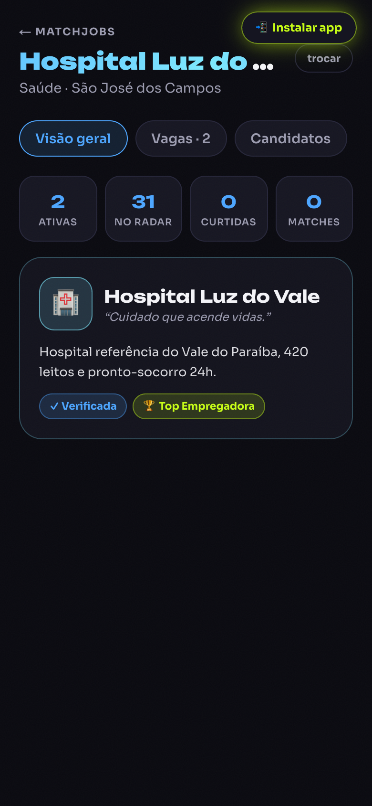
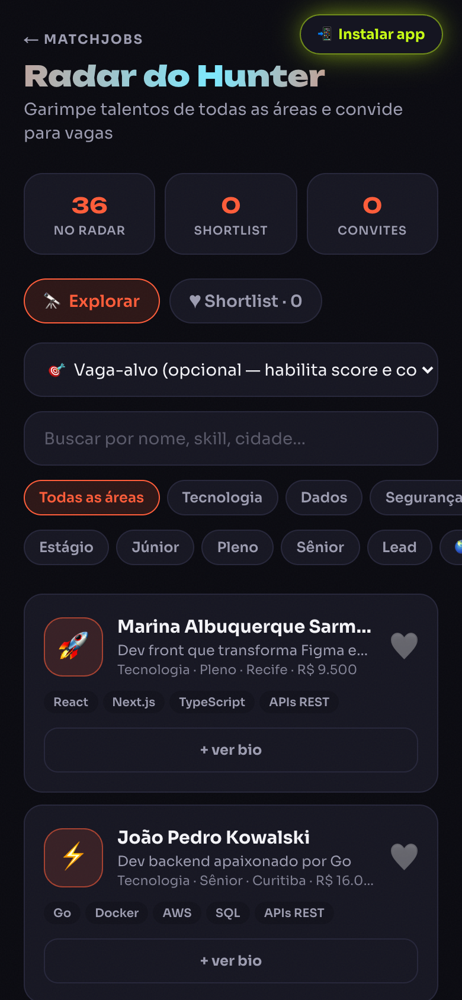
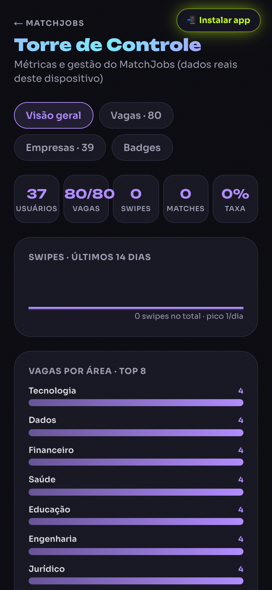
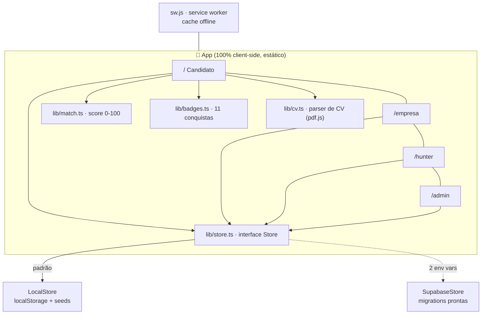
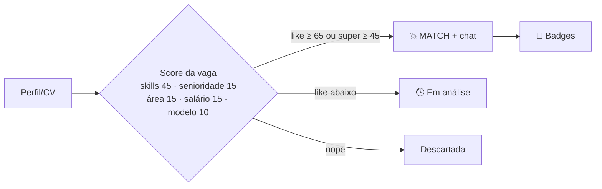

<div align="center">


# 💚 MatchJobs

### **O Tinder das vagas.** Deslize, dê match e converse com quem quer te contratar.

*Chega de formulário de 40 minutos, currículo em PDF ignorado e "manteremos seu cadastro em nosso banco de talentos".*

[](https://nextjs.org)
[](https://react.dev)
[](https://www.typescriptlang.org)
[](https://tailwindcss.com)
[](#4--instale-no-celular-pwa)
[](https://matchjobs-one.vercel.app)
[](LICENSE)

### 🔗 **[ABRIR O APP → matchjobs-one.vercel.app](https://matchjobs-one.vercel.app)**

**Candidato:** [/](https://matchjobs-one.vercel.app) · **Empresa:** [/empresa](https://matchjobs-one.vercel.app/empresa) · **Hunter:** [/hunter](https://matchjobs-one.vercel.app/hunter) · **Admin:** [/admin](https://matchjobs-one.vercel.app/admin)

</div>

---

## 📱 Screenshots

| Splash + PWA | Deck de vagas | Deu Match! |
|:---:|:---:|:---:|
|  |  |  |

| Perfil + Badges | Portal Empresa | Radar Hunter | Torre de Controle |
|:---:|:---:|:---:|:---:|
|  |  |  |  |

---

## 1 · O problema

| Modelo tradicional (InfoJobs, Gupy, Catho…) | MatchJobs |
|---|---|
| Formulário de 40 min por vaga | Perfil único de 1 minuto (ou importe o CV) |
| Currículo PDF que ninguém lê | Skills estruturadas que geram score |
| "Enviado" e silêncio eterno | Match instantâneo + chat |
| Busca por filtros chatos | Deck ordenado por compatibilidade |
| Algoritmo caixa-preta | Score transparente ("por que essa vaga?") |
| Só vagas de escritório/TI | **22 áreas** — de dev a confeiteira, de pedreiro a enfermeira |

> **A tese:** procurar emprego deveria ter a fricção de um app de namoro, não a de um cartório.

## 2 · Funcionalidades

### 👤 Candidato — [`/`](https://matchjobs-one.vercel.app)
- ✅ **Onboarding em 6 passos** — foto (comprimida no aparelho), headline, bio, contato, experiências, formação, idiomas
- ✅ **Importar CV (PDF/TXT)** — parsing **100% no dispositivo** (pdf.js + heurísticas): detecta nome, e-mail, telefone, LinkedIn, skills, experiências e formação; você revisa antes de aplicar
- ✅ **Deck estilo Tinder** — arraste para → *QUERO!*, ← *PASSO*, ⭐ *É ESSE!* (super); física com tilt 3D, glare que segue o dedo, rewind ↩️
- ✅ **Score de compatibilidade 0–100 transparente** com o motivo no card
- ✅ **Match instantâneo** com modal cinematográfico + chat (resposta de RH simulada e rotulada)
- ✅ **11 conquistas (badges)** bronze → diamante com animação de desbloqueio
- ✅ Candidaturas "em análise" sempre visíveis — nada some no vácuo

### 🏢 Empresa — [`/empresa`](https://matchjobs-one.vercel.app/empresa)
- ✅ 39 empresas demo com **5 selos de confiança** (Verificada ✓, Top Empregadora 🏆, Resposta Rápida ⚡, Diversidade+ 🌈, Contratação Ágil 🚀)
- ✅ Dashboard com KPIs · **publicar e pausar vagas** (form completo com skills da área)
- ✅ Fila de candidatos **pontuada por vaga** + **curtir de volta** (match-back)
- ✅ Likes do candidato aparecem em destaque 🔥 no painel da empresa

### 🎯 Hunter — [`/hunter`](https://matchjobs-one.vercel.app/hunter)
- ✅ Radar com 36 talentos de todas as áreas · filtros por área/senioridade/modelo + busca
- ✅ **Vaga-alvo**: pontua e ordena talentos por aderência à vaga
- ✅ Shortlist ❤️ persistente + convites 📨 para vagas

### 🛠️ Admin — [`/admin`](https://matchjobs-one.vercel.app/admin)
- ✅ Torre de Controle: KPIs, sparkline de swipes (14 dias), vagas por área, salário médio por área (SVG/CSS puro, sem libs)
- ✅ Gestão de vagas (ativar/pausar) · diretório de empresas · status das badges

## 3 · 🧪 Guia de teste (para RH e validação)

> Roteiro de 5 minutos para avaliar a experiência completa:

1. **Abra** https://matchjobs-one.vercel.app no celular (funciona no desktop também)
2. **[Opcional] Instale como app** — banner "📲 Instalar app" ou menu do navegador → *Adicionar à tela inicial*
3. **Crie o perfil** (~1 min) — ou toque em **"⚡ Já tenho currículo — importar"** e suba um PDF: veja os campos se preencherem sozinhos
4. **Deslize o deck** — repare no **score e no motivo** de cada vaga ("4 skills em comum"); arraste para a direita numa vaga com score ≥ 65 e veja o **DEU MATCH!**
5. **Converse no chat** do match (a resposta do RH é simulada e rotulada como simulação)
6. **Colecione badges** — cada marco desbloqueia uma conquista animada; veja a galeria no Perfil
7. **Troque de chapéu**:
   - [/empresa](https://matchjobs-one.vercel.app/empresa) → escolha uma empresa → veja a fila de candidatos e **curta de volta**
   - [/hunter](https://matchjobs-one.vercel.app/hunter) → defina uma vaga-alvo e monte sua shortlist
   - [/admin](https://matchjobs-one.vercel.app/admin) → métricas em tempo real do seu uso

**O que avaliar:** tempo até a primeira candidatura · clareza do score · sensação do swipe · vontade de voltar (badges) · utilidade do painel da empresa.

**Observações para o teste:**
- Os dados ficam **somente no seu dispositivo** (localStorage) — cada testador tem sua própria experiência isolada
- As empresas e o "aceite" do match são **simulados** neste MVP (regra de score) — o portal da empresa demonstra como o lado real funcionará
- Feedback: abra uma [issue](https://github.com/steinhauserhzs/matchjobs/issues)

## 4 · 📲 Instale no celular (PWA)

O MatchJobs é um **PWA nativo completo**: ícones maskable, service worker com cache offline, atalhos de app e tela cheia standalone.

| Android (Chrome) | iPhone (Safari) |
|---|---|
| 1. Abra o app no Chrome | 1. Abra o app no Safari |
| 2. Toque no botão **"📲 Instalar app"** (ou menu ⋮ → *Instalar app*) | 2. Toque em **Compartilhar** (□↑) |
| 3. Confirme — o ícone 💚 aparece na tela inicial | 3. **Adicionar à Tela de Início** |

Depois de instalado: abre em tela cheia, funciona **offline** (deck, perfil, matches) e tem atalhos de pressão longa para os portais Empresa/Hunter/Admin.

## 5 · Arquitetura





### Estrutura de pastas

```
app/                  → rotas: / (candidato), /empresa, /hunter, /admin, manifest PWA
components/           → Deck, JobCard, MatchModal, Chat, Onboarding, CvImport,
                        Profile, Matches, BadgeUnlock, TabBar, PwaSetup, ui (primitivas)
lib/
  types.ts            → domínio (Profile, Vaga, Empresa, Talento, Swipe, Badge…)
  match.ts            → algoritmo de score transparente + regra de match
  badges.ts           → definição e motor das 11 conquistas
  cv.ts               → extração de texto (pdf.js) + parser heurístico de CV
  store.ts            → camada de dados (LocalStore ↔ SupabaseStore)
  data.ts             → 22 áreas, skills por área, selos, formatação BRL
  seed-*.json         → 80 vagas · 39 empresas · 36 talentos
public/               → ícones PWA (SVG+PNG), sw.js, hero art (Higgsfield)
supabase/migrations/  → schema completo com RLS (matchjobs_*)
scripts/              → gen-seed-sql · gen-icons · screenshots
```

## 6 · Score & gamificação

**Score de compatibilidade (0–100)** — cada componente vira um "motivo" visível no card:

| Componente | Peso | Regra |
|---|---:|---|
| Skills em comum | 45 | proporção das skills da vaga que você tem |
| Senioridade | 15 | exata = 15 · 1 nível de distância = 8 |
| Área | 15 | mesma área da vaga |
| Salário | 15 | teto da vaga cobre sua pretensão (degrada proporcional) |
| Modelo | 10 | igual ao seu, ou vaga remota |

**Match instantâneo (MVP):** like com score ≥ 65 · Super Quero com ≥ 45 (o sinal forte "pesa" na decisão simulada da empresa).

**11 badges:** Estreante 🎬 · Em Ritmo 🏃 · Seletivo 🧐 · Super Fã ⭐ (bronze) — Maratonista 🏅 · Primeiro Match 💥 · Explorador 🧭 · CV na Mão 📄 (prata) — Perfil Nota 10 🌟 · Disputado 👑 (ouro) — Lenda do Deck 💎 (diamante)

**5 selos de empresa:** Verificada ✓ · Top Empregadora 🏆 · Resposta Rápida ⚡ · Diversidade+ 🌈 · Contratação Ágil 🚀

## 7 · Dados & privacidade

- **Local-first:** perfil, swipes, matches, mensagens e badges ficam em `localStorage` — nada sai do dispositivo
- **CV processado no navegador:** o PDF nunca é enviado a servidor nenhum
- **LGPD-friendly desde o dia 1:** botão "Apagar todos os meus dados" no perfil
- **Modo nuvem (opcional):** com `NEXT_PUBLIC_SUPABASE_URL` + `NEXT_PUBLIC_SUPABASE_ANON_KEY`, o `SupabaseStore` liga sozinho; migrations com RLS em [`supabase/migrations/`](supabase/migrations/) e seed via `node scripts/gen-seed-sql.mjs`
- ⚠️ Nota de segurança do modo nuvem demo: identidade por UUID de dispositivo e policies abertas ao `anon` — o hardening (Anonymous Auth + `auth.uid()`, rate limiting) está no roadmap e comentado nas migrations

## 8 · Rodando local

```bash
git clone https://github.com/steinhauserhzs/matchjobs.git
cd matchjobs
pnpm install
pnpm dev                        # http://localhost:3000

pnpm build && pnpm start        # build de produção (SW ativo)
node scripts/gen-icons.mjs      # regenera ícones PWA a partir dos SVGs
node scripts/gen-seed-sql.mjs   # regenera supabase/seed.sql a partir dos JSONs
node scripts/screenshots.mjs    # recaptura os screenshots do README (app na :3777)
```

## 9 · 🤖 Como foi construído (IA, plugins & ferramentas)

Este projeto foi construído em sessões de *vibe-coding* com **Claude Code** (modelo Claude Fable 5, Anthropic):

| Ferramenta / plugin | Papel |
|---|---|
| **Claude Code + skill `frontend-design`** | Arquitetura, todo o código e a direção de design "volt sobre noite" |
| **Higgsfield MCP** (modelo Nano Banana 2) | Hero arts 3D (cards com coração neon) da splash e do deck vazio |
| **Supabase MCP + CLI** | Provisionamento, migrations e validação do schema na nuvem |
| **Vercel CLI** | Deploy contínuo (main → produção) |
| **GitHub CLI** | Repositório, rename e automação git |
| **Claude Preview (browser)** | Testes end-to-end reais: onboarding, swipe, match, chat, portais |
| **Workflows multi-agente** | Geração paralela dos seeds (80 vagas / 36 talentos em 22 áreas) |
| **pdf.js (pdfjs-dist)** | Extração de texto de CV no navegador |
| **sharp / puppeteer-core** | Ícones PWA e screenshots automatizados do README |

Fontes: [Unbounded](https://fonts.google.com/specimen/Unbounded) (display) + [Sora](https://fonts.google.com/specimen/Sora) (texto) · Ícone e logo: SVG autoral (dois cards + coração volt)

## 10 · Modelo de negócio (visão)

1. **B2C grátis para sempre** — candidato nunca paga (liquidez do lado do talento)
2. **B2B por vaga ativa** — R$ 99–299/mês/vaga + destaque pago no deck
3. **Hunter Pro** — assinatura para headhunters (shortlists ilimitadas, exportação, multi-vaga)
4. **Super Quero como moeda** — upsell leve para candidatos power users
5. **Dados agregados anonimizados** — relatórios de mercado salarial/skills por região

## 11 · Roadmap

- [x] ~~Perfil completo com CV, foto e dados pessoais~~ ✅ v2
- [x] ~~Todas as áreas (22) e portais Empresa/Hunter/Admin~~ ✅ v2
- [x] ~~Badges, selos e PWA instalável com offline~~ ✅ v2
- [ ] **Fase 3 — dois lados reais:** Supabase Auth + Realtime (match e chat de verdade entre dispositivos), notificações push
- [ ] **Fase 4 — crescimento:** boost semanal, importação LinkedIn, IA para pitch do candidato e triagem assistida, filtros premium
- [ ] **Fase 5 — hardening:** RLS estrita com `auth.uid()`, rate limiting, moderação de chat, analytics de funil

## 12 · Licença

[MIT](LICENSE) — use, estude, adapte.

---

<div align="center">

**MatchJobs** · deslize pro trampo certo 💚


*Feito com 🔥 no Brasil*

</div>
